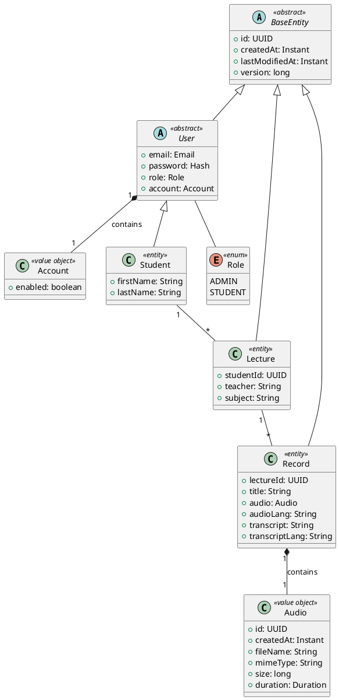

# Speech To Text

Das Projekt Speech To Text ist eine Webapplikation, die Studierenden beim Erlernen der deutschen Sprache
unterstützt und insbesondere ihr Hörverständnis- und Übersetzungsfähigkeiten verbessert.

## Team
- Sheikhi Hengvin
- Dalal Skheita

## Key Features

1. Übersetzung des Vortragenden:  
   • Die "Speak-to-Text"-Funktion ist integraler Bestandteil der gesamten
   Webapplikation.  
   • Der umgewandelte Text kann in verschiedene Sprachen übersetzt werden, um
   das Verständnis weiter zu erleichtern.  
   • Sie ermöglicht es den Studierenden, gesprochene Worte oder Sätze des
   Vortragenden (eventuell Echtzeit) in Text umzuwandeln.
2. Kostenlose Verwendung:  
   • Die Nutzung der "Speak-to-Text"-Funktion ist für alle Studierenden kostenlos
   verfügbar.  
   • Dies trägt dazu bei, die Barrierefreiheit zu gewährleisten und den breiten
   Zugang für alle Studierenden zu ermöglichen.
3. Lehrer-Schüler-Interaktion:  
   • Die Funktion unterstützt die Interaktion zwischen Lehrern und Studierenden.  
   • Lehrer können mündliche Anweisungen geben, die von der Spracherkennung
   erfasst und in Text umgewandelt werden  

## UML

